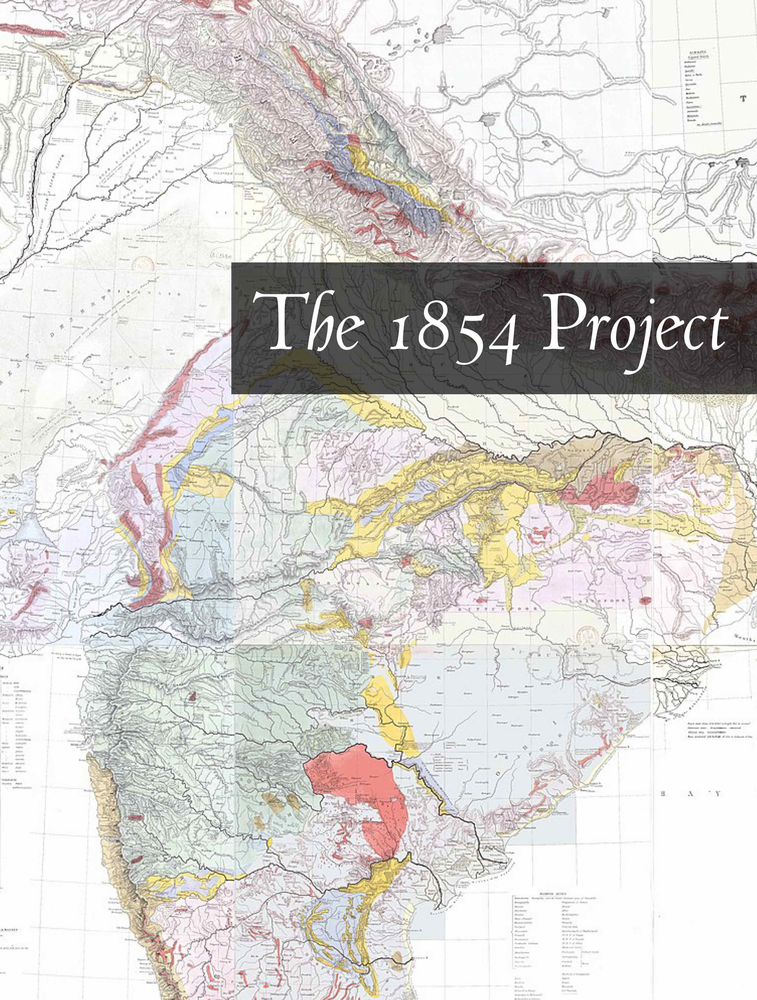

## ভারতবর্ষ[^1]

The 1854 Project

a new retrospective 
by 
Kalpit Parikh 

ॐ असतो मा सद्गमय । 
तमसो मा ज्योतिर्गमय । 
मृत्योर्माऽमृतं गमय ॥ 
ॐ शान्तिः शान्तिः शान्तिः ॥  

## Impressum

Published in  કલા નગરી, *kalā nagarī*: "city of art"[^2] by મન, *man*: "mind"[^3]

Cataloging in Publication Data

Name: Kalpit Parikh, 2023— author 
Title: The 1854 Project/ Kalpit Parikh 
ASIN: 
Subjects: 1. Sociology 2. Epistemology

## Contents

Author’s Note  
A Note About This Book  
Epigraph  
Preface  

1. Capitalism and Indology
2. Utilitarianism and Empire
3. Indian Indenture System
4. Coloniality of Knowledge
5. Eighteen Fifty Seven
6. Colonialism and Caste
7. Indian Independence Movement
8. Divide and Rule
9. Communalism and Politics
11. India and The Making of The Modern World
12. Constitution of India
13. Global Wealth Gap
15. Eurocentrism and Public Education
16. India and Politics of History
    
Dedication  
Acknowledgement  
Contributors  
Notes  
Credits  
   
## README

The chapters of this book occur on a time-line that runs chronologically from 
the eariliest developments of Colonial Indology to the present. While the chapters are 
not strictly chronological, they have been arranged with a historial narratrive in mind.  

## A Note About This Book

This book occasionally uses words whose meanings have changed over time, and 
in some cases remain actively debated. In almost every case, the book tries to 
trace traditional meanings and highlight the ways Colonial Indology has shaped discourse. 

## Epigraph 

> उत्तिष्ठत जाग्रत प्राप्य वरान्निबोधत, 
> क्षुरासन्न धारा निशिता दुरत्यद्दुर्गम पथ: तत् कवयो वदन्ति |
>
> uttisthata jagrata prapya varannibodhata  
> kshurasanna dhara nishita durataya durgama pathah tat kavayo vadanti
>
> Arise! Awake! Approach the great and learn.  
> Like the sharp edge of a razor is that path, so the wise say—hard to tread and difficult
> to cross (Katha Upanishad 1.3.14).

## Preface 	

### Capitalism and Indology
### Utilitarianism and Empire
### Indian Indenture System
### Coloniality of Knowledge
### Eighteen Fifty Seven
### Colonialism and Caste
### Indian Independence Movement
### Divide and Rule
### Communalism and Politics
### India and The Making of The Modern World
### Constitution of India
### Global Wealth Gap
### History of Colonialism
### Eurocentrism and Public Education
### India and Politics of History

## Dedication 

Indians—Past, Present and Future

## Acknowledgement

This book grew out of the original version of the 1619 Project, published in *The New York Times Magazine* in 
August 2019, and from long-running efforts to reframe India’s history by placing the consequences of 
colonialism and the contributions of Indians at the very center of India’s many narratives.

## Notes 

*The Upanishads: Volume One: Katha, Īśa, Kena, and Mundaka*. Translated by Swami Nikhilananda, Harper & Brothers, 1949.

Apte, Vaman Shivram. *Apte Practical Sanskrit-English Dictionary.* Shiralkar, 1890.

Belsare, Malhar Bhikaji. *ગુજરાતી-અંગ્રેજી ડિકશનરી \[Etymological
Gujarati-English Dictionary\].* 2nd Edition, Asian Educational Services,
2002.

Biswas, Sailendra. Samsad Bengali-English dictionary. 3rd ed. Calcutta, Sahitya Samsad, 2000.

Chakrabarti, Dilip K. *Colonial Indology: Sociopolitics of the Ancient Indian Past*. 
Munshiram Manoharlal Publishers Pvt. Limited, 1997.

## Contributors 

**Kalpit Parikh** is an independent researcher in New Jersey focusing on the history of Colonial Indology.[^4]

## Credits 

1. Greenough, George Bellas. *General sketch of the physical and
   geological features of British India*, 1855.
2. Hannah-Jones, Nikole. *The 1619 Project: A New Origin Story.* Random
   House Publishing Group, 2021.
 
[^1]:  ভারত bhārata n. India (formerly including Pakistan), the Republic of India, 
    the Indian Union; a son or descendant of King Bharata (ভরত); the Mahabharata. ~নাট্যম n. 
    Bharat Natyam, an Indian classical dance form. ~বর্ষ same as ভারত excepting the last two 
    meanings. ~বর্ষীয় a. of or dwelling in India, Indian. ~বাসী a. living in India, Indian. n. 
    an Indian. ~মহাসাগর n. the Indian Ocean. ~মাতা n. India personified as the common mother 
    of all Indians; Mother India. ~রত্ন n. a jewel of India; the title of highest honour 
    conferred upon eminent citizens by the President of India. ~রাষ্ট্র n. the Republic of India, 
    the Indian Union. ~সন্তান n. a child of the Indian soil, an Indian. ~সভা n. Indian 
    Association. ~সরকার n. the Government of India, the Indian Government. 
    ভারতের সংবিধান the Constitution of India (Biswas 814).

[^2]: કલા, Classical form of કળા An art (Belsare 227) + નગર a city (Belsare 301).
    
[^3]: તન-મન-ધન a. n. \[See તન + મન + ધન\] Lit. The body, the mind, and
    one’s wealth. Hence, 2. All that one loves; the highest object of
    one’s ambition (Belsare 577).

[^4]: This book explores some underlying theoretical premises of the Western study of ancient India. 
    These premises developed in response to the colonial need to manipulate the Indians' perception 
    of their past. The need was felt most strongly from the middle of the nineteenth century onwards, 
    and an elaborate racist framework, in which the interrelationship between race, language and 
    culture was a key element, slowly emerged as an explanation of the ancient Indian historical 
    universe. The measure of its success is obvious from the fact that the Indian nationalist historians 
    left this framework unchallenged, preferring to dispute it only in some comparatively minor matters 
    of detail. This book argues that this framework is still in place, and implicitly accepted not merely
    by Western Indologists but also by their Indian counterparts. The image of the ancient Indian past 
    remains the same. The persistence of the old image is reflective of India's relationship as a part 
    of the Third World with the West and Western historical scholarship (Chakrabarti ix).
